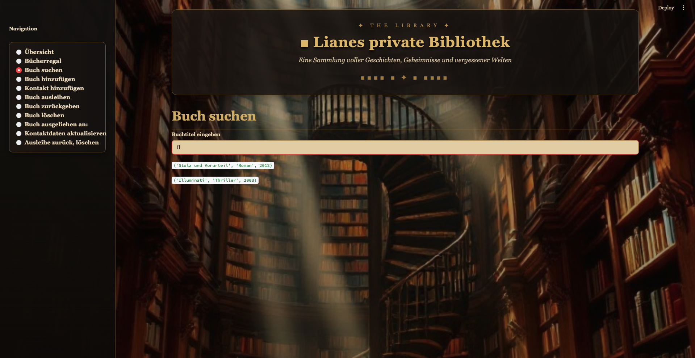

# Lianes Bibliothek — Bibliotheksverwaltungssystem
(MySQL, SQLAlchemy, Streamlit)



Bibliotheksverwaltungssystem für **Lianes Bibliothek**: Liane besitzt eine große Büchersammlung und verleiht gern Bücher — verliert dabei aber den Überblick, wer welches Buch hat. **Wie bekommt Liane eine zentrale, selbst bedienbare Übersicht über Bücher, Ausleiher und Ausleihen, ganz ohne SQL-Kenntnisse?**

📊 [Präsentation](5.Praesentation/) · 📄 [Pflichtenheft](6.Pflichtenheft/) · 🧩 [SQL-Skript](1.Database/) · 🖥️ [Streamlit-App](4.App/)

Dieses Projekt entstand als Gruppenarbeit (Team: Joell, Patricia, Mathias) im Rahmen des WBS-Kurses Data Science & AI; dieses Repository dokumentiert die gemeinsame Ausarbeitung. Mathias vertieft das Datenmodell zusätzlich individuell auf einer eigenen Datenbank (`mydb`) — nicht Teil der gemeinsamen Gruppenabgabe.

## Projektübersicht & Status

Aus vier Kernentitäten (Bücher, Autoren, Ausleiher, Ausleihen) wurde ein normalisiertes Datenmodell (3NF) entworfen, in MySQL umgesetzt und über SQLAlchemy an eine Streamlit-Oberfläche angebunden, mit der Liane Bücher und Ausleiher anlegen, Ausleihen erfassen, Kontaktdaten pflegen und den Ausleihstatus jederzeit einsehen kann — ohne eine Zeile SQL zu schreiben.

**Stand:** Datenbankdesign, SQLAlchemy-Anbindung und alle CRUD-Funktionen fertig und getestet. Die Streamlit-Oberfläche ist vollständig an das Backend angebunden (Bücherregal mit Filter, Gesamtübersicht als Tabelle, alle Formulare), das Design (Dark-Academia-Thema, Hintergrundbild) steht. Offen sind Eingabevalidierung, ein `UNIQUE`-Constraint auf der ISBN (siehe Erkenntnisse unten) und die in „Folgeprojekte" (Pflichtenheft) gesammelten Erweiterungsideen.

## Daten & Technologien

- **Tabellen:** `authors`, `books`, `borrowers`, `loans` — `authors` 1:n `books`, `books` n:m `borrowers` über die Verbindungstabelle `loans`
- **Testdaten:** 10 Autoren, 10 Bücher, 10 Ausleiher, 10 Ausleihen (Gruppen-Skript) plus ergänzte Einzeltests
- **Datenbank:** MySQL (MySQL Workbench, lokal)
- **Python-Anbindung:** SQLAlchemy + PyMySQL (`engine.begin()` für Commit/Rollback, `engine.connect()` für reine Lesezugriffe)
- **Oberfläche:** Streamlit (`st.sidebar`, `st.radio`, `st.form`, `st.selectbox`, `st.table`)
- **Umgebung:** Conda, VS Code
- **Architektur:** strikte Dateitrennung — `db_connection.py` (Verbindung), `crud_functions.py` (SQL-Logik), `style.py` (Design), `app.py` (Oberfläche, kein SQL)

## Wichtigste Erkenntnisse & nächste Schritte


*Vier Tabellen, drei Beziehungen — `loans` löst die n:m-Beziehung zwischen `books` und `borrowers` auf.*

- **Datentypen wurden recherchiert, nicht geraten:** ISBN als `VARCHAR(17)` statt `INT` (führende Nullen und das „X" bei alter ISBN-10 gingen sonst verloren), Telefonnummern als `VARCHAR(22)` aus demselben Grund → **nächster Schritt:** entsprechende `CHECK`-Constraints ergänzen.
- **Fehlender `UNIQUE`-Constraint auf ISBN hat sich real ausgewirkt:** Beim Testen von `buch_hinzufuegen()` entstanden dadurch mehrfache Duplikate desselben Buchs → **nächster Schritt:** `UNIQUE` auf ISBN ergänzen, das war vorher nur ein theoretisches Risiko.
- **Mehrfachexemplare sind nur ein Platzhalter:** Das Feld `duplicate` in `books` klärt bislang nicht, wie mehrere Kopien desselben Titels sauber abgebildet werden → **nächster Schritt:** eigene Exemplar-Tabelle prüfen.
- **Sicherheitsprüfungen konsequent umgesetzt:** `buch_loeschen()` und `ausleihe_loeschen()` verhindern das Löschen laufender Ausleihen bzw. verliehener Bücher (SELECT-Check vor dem DELETE); `buch_ausleihen()` verhindert doppelte Ausleihen desselben Buchs.
- **Weitere offene Punkte:** Eingabevalidierung, Umstellung des Passwort-Handlings auf `.env`/`python-dotenv`, zentrale Versionsverwaltung (Git) noch nicht im Einsatz, keine gemeinsame Datenbankinstanz (lokal je Person). Umfangreichere Erweiterungsideen (Statistik-Dashboard, Änderungshistorie, überfällige Ausleihen, Buchcover, API) siehe Pflichtenheft, Kapitel „Folgeprojekte".

## Repository-Struktur

```
README.md          # diese Datei
1.Database/         # ER-Diagramm (Lianes-DB-design.mwb), schema.sql (DDL + Testdaten)
2.Images/           # Screenshots für README & Präsentation
3.Backend/          # db_connection.py, crud_functions.py — Verbindung & SQL-Logik
4.App/              # app.py, style.py, library_background.png — Streamlit-Oberfläche & Design
5.Praesentation/    # PowerPoint für die Projekt-Demo
6.Pflichtenheft/    # Pflichtenheft, Projektplan, Brainstorming-Dokumentation
```

## Wie man dieses Projekt nutzt

1. **Konzept verstehen:** zuerst `1.Database/` öffnen (ER-Diagramm zeigt Tabellen und Beziehungen)
2. **Entscheidungen nachvollziehen:** `6.Pflichtenheft/` — dort stehen alle Datentyp-Entscheidungen inkl. Begründung, der zeilenweise kommentierte Code und der aktuelle Umsetzungsstand
3. **Backend nachvollziehen:** `3.Backend/` — `crud_functions.py` enthält die reine SQL-Logik je Operation
4. **App starten:**
   ```bash
   pip install streamlit sqlalchemy pymysql pandas
   streamlit run 4.App/app.py
   ```
   (lokale MySQL-Instanz `lianes_library`, Schema aus `1.Database/schema.sql`, vorausgesetzt)

## Kontakt

- **Team:** Joell, Patricia, Mathias — WBS Coding School, Data Science & AI Kurs

---

## English Summary

This project builds a library management system for **Lianes Bibliothek**: a private book collection with no way to track who has borrowed what. A normalized data model (`authors`, `books`, `borrowers`, `loans`, 3NF) was designed in MySQL and connected via SQLAlchemy to a Streamlit interface, so the owner can add books and borrowers, log loans, update contact details, and check loan status without writing SQL.

**Status:** database design and all CRUD functions are done and tested; the Streamlit interface is fully wired to the backend. Open items: input validation, a `UNIQUE` constraint on ISBN (duplicate books were created during testing without it), and a dedicated table for multiple copies of the same title — see the Pflichtenheft's "Folgeprojekte" section for further extension ideas (statistics dashboard, change log, overdue warnings, book covers, API).

Full documentation: see the German sections above and the [Pflichtenheft](6.Pflichtenheft/).
